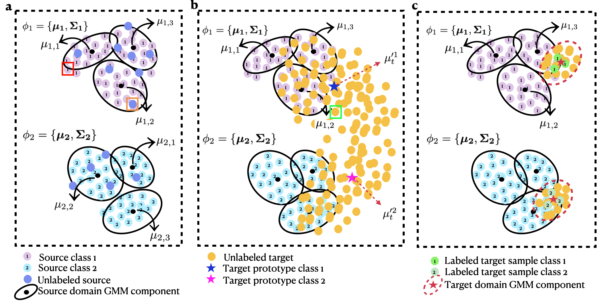

# Setup Datasets

Cityscapes: Please, download leftImg8bit_trainvaltest.zip and gt_trainvaltest.zip and extract them to data/cityscapes using the following link:
https://www.cityscapes-dataset.com/downloads/

GTA: Please, download all image and label packages and extract them to data/gta using the following link: https://download.visinf.tu-darmstadt.de/data/from_games/

Synthia: Please, download SYNTHIA-RAND-CITYSCAPES and extract them to data/synthia using the following link: https://synthia-dataset.net/downloads/

# Download pretrained models

Please, download SegFormer's official MiT-B5 weights (i.e., mit_b5.pth) pretrained on ImageNet-1k and put it into a new folder ./pretrained using the following link:

https://drive.google.com/drive/folders/1b7bwrInTW4VLEm27YawHOAMSMikga2Ia?usp=sharing

# Data preparation
Please run the following scripts to preprocess data :

python tools/convert_datasets/gta.py data/gta --nproc 8

python tools/convert_datasets/cityscapes.py data/cityscapes --nproc 8

python tools/convert_datasets/synthia.py data/synthia/ --nproc 8

# Train the model
To train the model please run the below scripts:

1- Fully labeled source data and unlabeled target data (GTA -> Cityscapes):

python run_experiments.py --exp 2

2- Partially labeled source (i.e. consist of both labeled and unlabeled data) and unlabeled target data (GTA -> Cityscapes):

python run_experiments.py --exp 2 --ulabeled

2- Fully labeled source data and weakly labeled target data(GTA -> Cityscapes):

python run_experiments.py --exp 2 --weak_target

To train the model for Synthia -> Cityscapes, use --exp 3 instead of --exp 2 

To generate weak labels use generate_weak_target.py. You may need to set the directory for weak target labels on both generate_weak_target.py and corresponding python files in configs/_base_/datasets.

# Acknowledgments
This project is based on the following open-source projects. We thank their authors for making the source code publicly available.

MMSegmentation (Apache License 2.0)

SegFormer (NVIDIA Source Code License)

DAFormer (Apache License 2.0)

SePiCo (Apache License 2.0)

DACS (MIT License)

DANNet (Apache License 2.0)

GMMSeg (Apache License 2.0)

